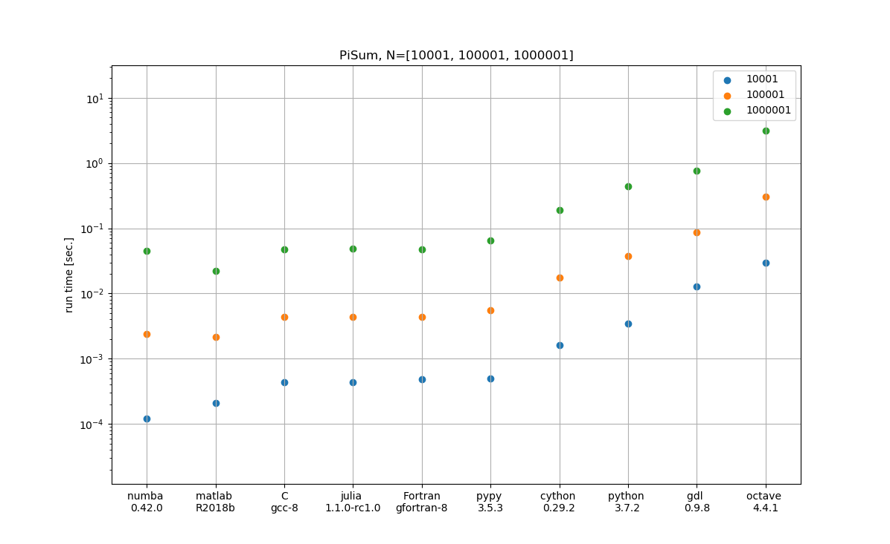

[](https://travis-ci.org/scivision/python-performance)
[](https://coveralls.io/github/scivision/python-performance?branch=master)
[](https://ci.appveyor.com/project/scivision/python-performance)

# Python Performance

All benchmarks are platform-independent (run on any computing device with appropriate hardware). 
A few tests require an NVIDIA GPU with Cuda toolkit installed.

Continuous integration conducted on:

-   Ubuntu (Travis-CI)
-   MacOS (Travis-CI)
-   Windows (AppVeyor)

Tested on Python 3.5, 3.6 and PyPy3.

## Install

This command compiles the Fortran code and prepares Python prereqs:

    pip install -e .

## Usage

Iterative benchmarks, here using the pisum algorithm:

    ./Pisum.py



Matrix Multiplication benchmarks:

    ./Matmul.py

### Fortran

"kind" demo:

    ./bin/kind

### Hypotenuse

Observe that `hypot()` is faster from 1 to a few hundred elements, then
sqrt(x^2+y^2) becomes slightly faster. However, `hypot()` does not
overflow for arguments near REALMAX. For example, in Python:

```python
from math import sqrt, hypot

a=1e154; hypot(a,a); sqrt(a**2+a**2); 

1.414213562373095e+154
inf
```

Execute the Hypot speed test by:

    ./RunHypot.py


## Notes

### Julia

Julia binaries are often downloaded to a particular directory. 
Python doesn't pickup `.bash_aliases`, which is commonly used to point to Julia.

### Compiler selection

Intel Fortran:
```sh
FC=ifort cmake ..
```
GNU Fortran (gfortran &ge; 6 required):
```sh
FC=gfortran cmake ..
```

### MKL selection

https://software.intel.com/en-us/articles/intel-mkl-link-line-advisor

We give a hint to CMake where your MKL libraries on. 
For example:
```sh
MKLROOT=/opt/intel/mkl cmake ..
```
Of course this option can be combined with `FC`.

You can set this environment variable permanently for your convenience
(normally you always want to use MKL) by adding to your `~/.bashrc` the
line:
```sh
export MKLROOT=/opt/intel/mkl
```
