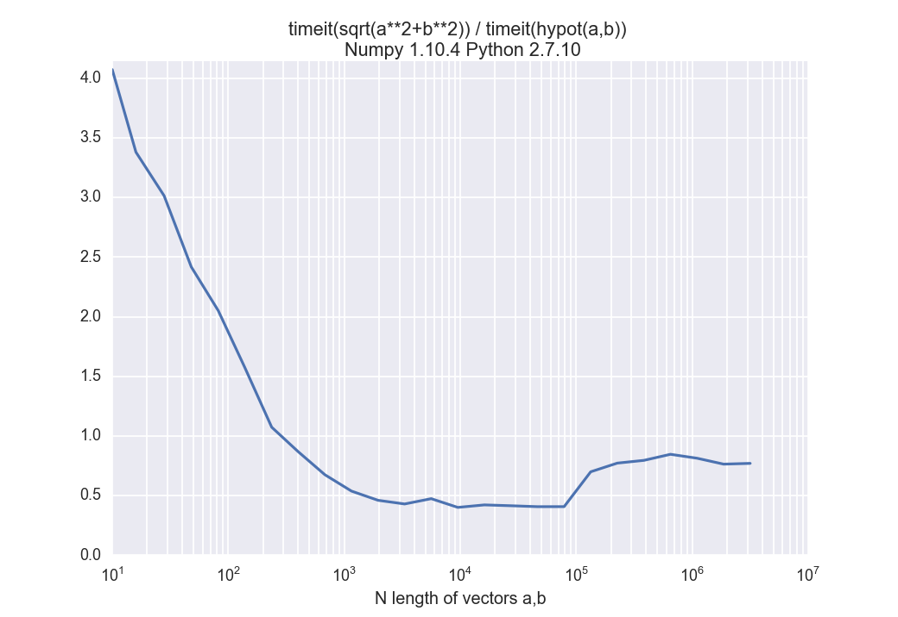

.. image:: https://travis-ci.org/scienceopen/python-performance.svg?branch=master
    :target: https://travis-ci.org/scienceopen/python-performance

==================
Python Performance
==================

All benchmarks are platform-indepenent (run on any computing device with appropriate hardware).
A few tests require an NVIDIA GPU with Cuda toolkit installed.

To compile the benchmarks::

    cd bin
    cmake ..
    make
    
.. contents ::

Compiler selection
==================

Intel Fortran::

    FC=ifort cmake ..

GNU Fortran::

    FC=gfortran cmake ..
    
MKL selection
==============
<https://software.intel.com/en-us/articles/intel-mkl-link-line-advisor>

We give a hint to CMake where your MKL libraries on. 
On Linux, this is typically ``/opt/intel/mkl``::

    MKLROOT=/opt/intel/mkl cmake ..
    
Of course this option can be combined with ``FC``.

You can set this environment variable permanetly for your convenience (normally you always want to use MKL) by adding to your ``~/.bashrc`` the line::

    export MKLROOT=/opt/intel/mkl

Benchmarks
===========
Iterative benchmarks, here using the pisum algorithm::

    ./RunPisum.py

Matrix Multiplication benchmarks::

    ./RunMatmul.py

Fortran
-------
"kind" demo::

    ./bin/kind

Hypotenuse
----------
Observe that hypot() is faster from 1 to a few hundred elements, then sqrt(x**2+y**2) becomes slightly faster, but hypot is more numerically stable::

    ./RunHypot.py

.. image:: py35hypot.png
  :alt: Pyhton 3.5 hypot() vs rsq()
  :scale: 60%

Old Notes
=========
[ Numba 0.15.1 bug has been patched.](https://github.com/numba/numba/pull/857)

