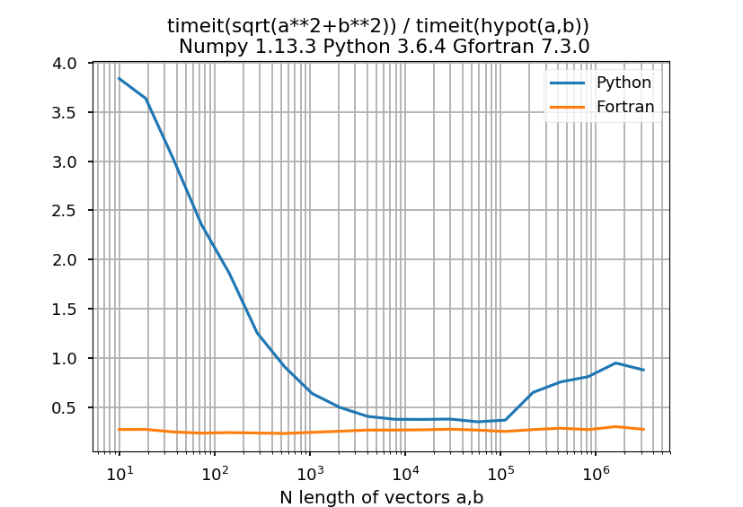

.. image:: https://travis-ci.org/scivision/python-performance.svg?branch=master
    :target: https://travis-ci.org/scivision/python-performance
    
.. image:: https://ci.appveyor.com/api/projects/status/ofqahr0voj4bvmxw?svg=true
   :target: https://ci.appveyor.com/project/scivision/python-performance

==================
Python Performance
==================

All benchmarks are platform-indepenent (run on any computing device with appropriate hardware).
A few tests require an NVIDIA GPU with Cuda toolkit installed.

Continuous integration conducted on:

* Ubuntu (Travis-CI)
* MacOS  (Travis-CI)
* Windows (AppVeyor)

   
.. contents ::

Install
=======
This command compiles the Fortran code and prepares Python prereqs::

    pip install -e .

Usage
=====
Iterative benchmarks, here using the pisum algorithm::

    ./RunPisum.py

Matrix Multiplication benchmarks::

    ./RunMatmul.py

Fortran
-------
"kind" demo::

    ./bin/kind

Hypotenuse
----------
Observe that ``hypot()`` is faster from 1 to a few hundred elements, then sqrt(x^2+y^2) becomes slightly faster.
However, ``hypot()`` does not overflow for arguments near REALMAX.
For example, in Python:

.. code:: python

    from math import sqrt, hypot
    
    a=1e154; hypot(a,a); sqrt(a**2+a**2); 

    1.414213562373095e+154
    inf
    
Execute the Hypot speed test by::

    ./RunHypot.py

.. image:: py27hypot.png
  :alt: Python 2.7 hypot() vs rsq()
  :scale: 60%

.. image:: py35hypot.png
  :alt: Python 3.5 hypot() vs rsq()
  :scale: 60%

Notes
=====

Julia
-----
Julia binaries are often downloaded to a particular directory. 
Python doesn't pickup ``.bash_aliases``, which is commonly used to point to Julia.

Compiler selection
------------------

Intel Fortran::

    FC=ifort cmake ..

GNU Fortran (gfortran >= 6 required)::

    FC=gfortran cmake ..
    
    
Plain
    
MKL selection
-------------
<https://software.intel.com/en-us/articles/intel-mkl-link-line-advisor>

We give a hint to CMake where your MKL libraries on. 
On Linux, this is typically ``/opt/intel/mkl``::

    MKLROOT=/opt/intel/mkl cmake ..
    
Of course this option can be combined with ``FC``.

You can set this environment variable permanetly for your convenience (normally you always want to use MKL) by adding to your ``~/.bashrc`` the line::

    export MKLROOT=/opt/intel/mkl

